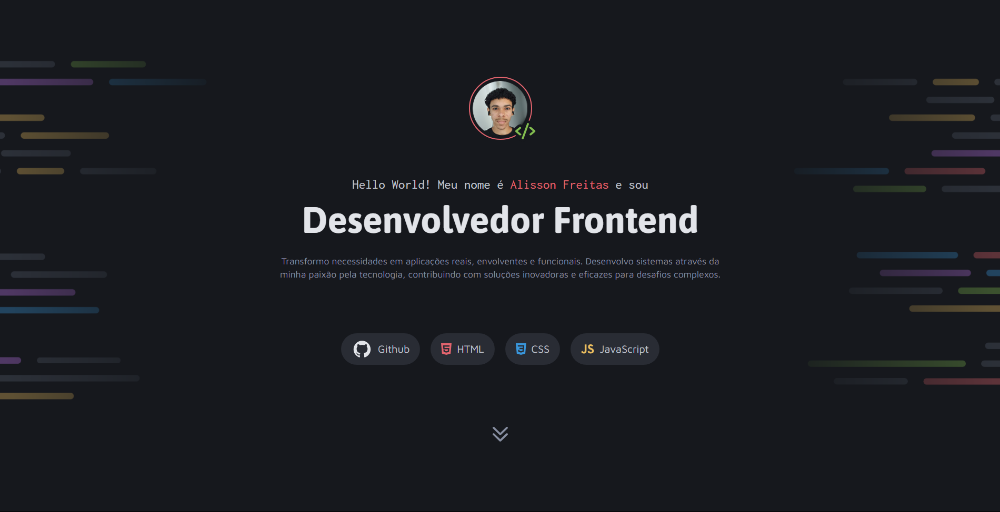

<h1 align="center"> Portfólio Dev 👨‍💻🚀 </h1>

  <a href="#-o-projeto">O Projeto</a>&nbsp;&nbsp;&nbsp;|&nbsp;&nbsp;&nbsp;
  <a href="#-tecnologias">Tecnologias</a>&nbsp;&nbsp;&nbsp;|&nbsp;&nbsp;&nbsp;
  <a href="#-layout">Layout</a>&nbsp;&nbsp;&nbsp;|&nbsp;&nbsp;&nbsp;
  <a href="#-licença">Licença</a>

  
  

## 💻 O Projeto

Este é o meu portfólio pessoal, desenvolvido para apresentar minha trajetória como Desenvolvedor, listar meus projetos de destaque e facilitar o contato profissional. A aplicação foi construída com foco em semântica, modularidade e design responsivo, garantindo uma ótima experiência de navegação em qualquer dispositivo. Os principais destaques do desenvolvimento incluem:

1. **Arquitetura CSS Modular:** Utilização da regra `@import` no arquivo principal (`index.css`) para dividir a estilização em arquivos menores (global, header, main, footer, utility, responsive). Isso facilita a manutenção, leitura e escalabilidade do código.
2. **Variáveis CSS Customizadas:** Uso do seletor `:root` para definir um *Design System* próprio, armazenando a paleta de cores (ex: `--gray-500`, `--purple`) e a tipografia base. Isso garante total consistência visual e facilita futuras alterações de tema.
3. **Design Responsivo Estratégico:** Implementação de *Media Queries* adaptando as estruturas de `CSS Grid` (na galeria de projetos) e `Flexbox`, ajustando a exibição de três colunas no desktop para uma coluna única em dispositivos móveis, sem perda de qualidade visual.

## 🚀 Tecnologias

Este projeto foi construído utilizando as seguintes ferramentas e conceitos:

* **HTML5:** Utilizado para criar a estrutura semântica da página (`<header>`, `<main>`, `<section>`, `<footer>`), melhorando a acessibilidade e organização do conteúdo.
* **CSS3:** Responsável por toda a estilização, utilizando `Flexbox` para alinhamentos centrais e `CSS Grid` para a organização estruturada dos cartões de projetos.
* **Git & GitHub:** Versionamento e deploy da aplicação.

## 🔖 Layout

Você pode visualizar e interagir com o projeto através dos links abaixo:

* 📲 **[Acesse o layout original do projeto aqui](https://www.figma.com/community/file/1387080701963671866/portfolio-dev)**
* 👉 **[Acesse o site funcionando aqui](https://alissonfa.github.io/portfolio-dev/)**

**Para rodar no seu computador (Local):**
1. Faça o download ou clone o repositório.
2. Certifique-se de que a estrutura de pastas está correta.
3. Dê um duplo clique no arquivo `index.html` ou abra através da extensão *Live Server* no seu editor de código.

## 📝 Licença

Esse projeto está sob a licença MIT.

---

Feito com 💜 por **[AlissonFA](https://www.linkedin.com/in/alissonfa/)**